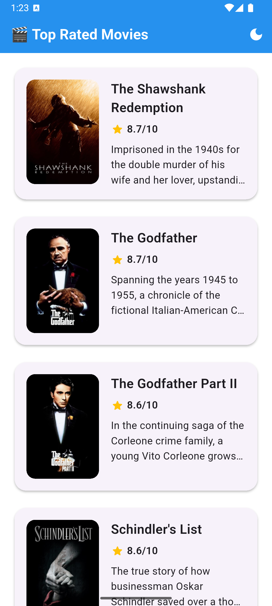
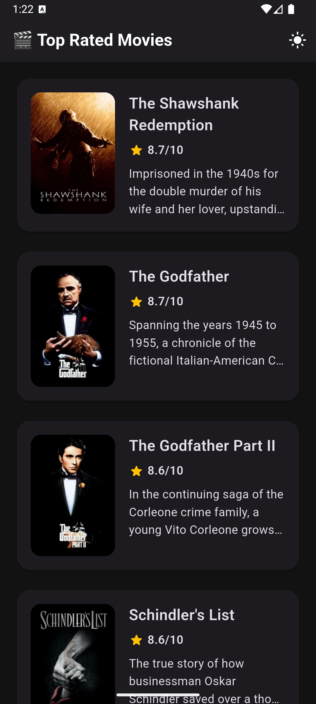
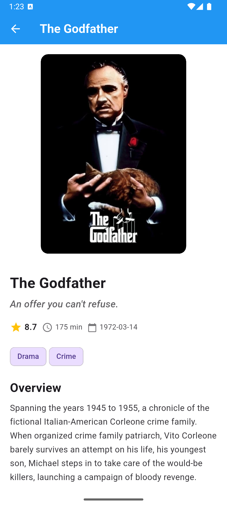
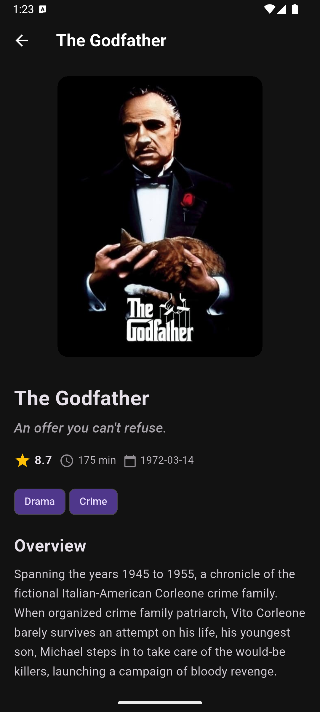

# 🎬 Movie App

A Flutter movie browsing app built with Clean Architecture, BLoC, Retrofit/Dio networking, and offline cache. It features a details screen, dark/light theme toggle, pull-to-refresh, and smooth poster Hero animations.

## ✨ Features

- Browse movies with cached images and shimmer placeholders
- Movie details screen (overview, genres, cast)
- Poster Hero animation from list to details
- Pull-to-refresh on the movies list
- Dark/Light theme toggle at runtime
- Offline cache for details via SQLite
- Typed networking via Retrofit + Dio, with logging

## 🧱 Architecture

Feature-based Clean Architecture with strict layer separation:

```
lib/
├── core/
│   ├── di/                # get_it service locator
│   ├── network/           # Dio + Retrofit clients and interceptors
│   ├── styles/            # Themes, colors, text styles
│   ├── utils/             # Helpers, extensions, constants
│   └── widgets/           # Shared UI
│
├── features/
│   ├── movies/            # List/browse movies (presentation widgets & blocs)
│   └── movie_details/     # Details feature (data/domain/presentation)
│       ├── data/          # DTOs, sources, repositories (Retrofit + SQLite)
│       ├── domain/        # Entities, use cases
│       └── presentation/  # Cubits/Blocs, screens, widgets
│
├── movie_app.dart         # Root widget (theme wiring, router)
└── main.dart              # Bootstrap (dotenv, DI, runApp)
```

Technologies:

- State: `flutter_bloc`, `freezed`, `equatable`
- DI: `get_it`
- Network: `dio`, `retrofit`, `pretty_dio_logger`, `json_serializable`
- Storage: `sqflite`, `shared_preferences`, `cached_network_image`
- UI: `go_router`, `flutter_screenutil`, `shimmer_animation`
- Env: `flutter_dotenv`

## 📸 Screenshots

| Home (Light)                              | Home (Dark)                             | Details                             |
| ----------------------------------------- | --------------------------------------- | ----------------------------------- |
|  |  |  |

Additional examples:

| Details (Dark)                                | Load More                               |     |
| --------------------------------------------- | --------------------------------------- | --- |
|  |  |     |

## ⚙️ Setup

Prerequisites:

- Flutter SDK 3.24+ and Dart 3.5+
- A TMDB API Bearer token

1. Create a `.env` file in the project root (already declared in `pubspec.yaml` assets):

```env
TMDB_API_KEY=YOUR_TMDB_API_KEY
TMDB_ACCESS_TOKEN=YOUR_TMDB_BEARER_TOKEN
```

1. Install dependencies and generate code (Freezed/Retrofit/JSON):

```bash
flutter pub get
flutter pub run build_runner build --delete-conflicting-outputs
```

1. Run the app:

```bash
flutter run
```

## 🚀 Development Notes

- The app loads environment variables in `main.dart` using `flutter_dotenv`.
- Network requests attach the TMDB Authorization header from `dotenv.env['TMDB_ACCESS_TOKEN']` (see `core/network/dio_factory.dart`).
- The details feature uses a cache-first strategy backed by SQLite for offline use.
- Hero animations are driven by a shared poster tag between list and details.

---

If screenshots don’t appear, ensure your images live under `screenshots/` with the same names used above (or update the paths in this README).
